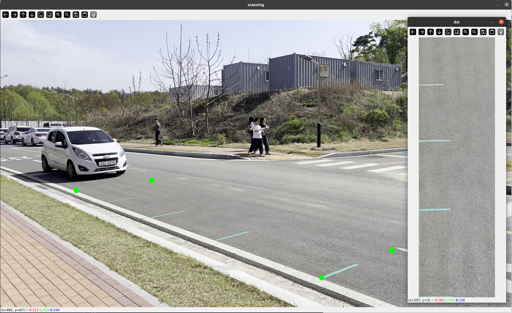
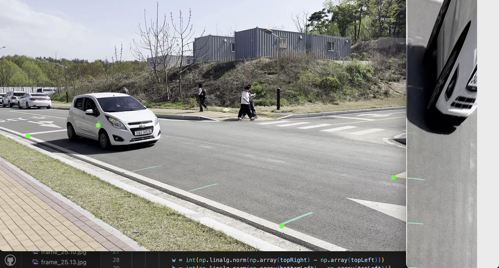
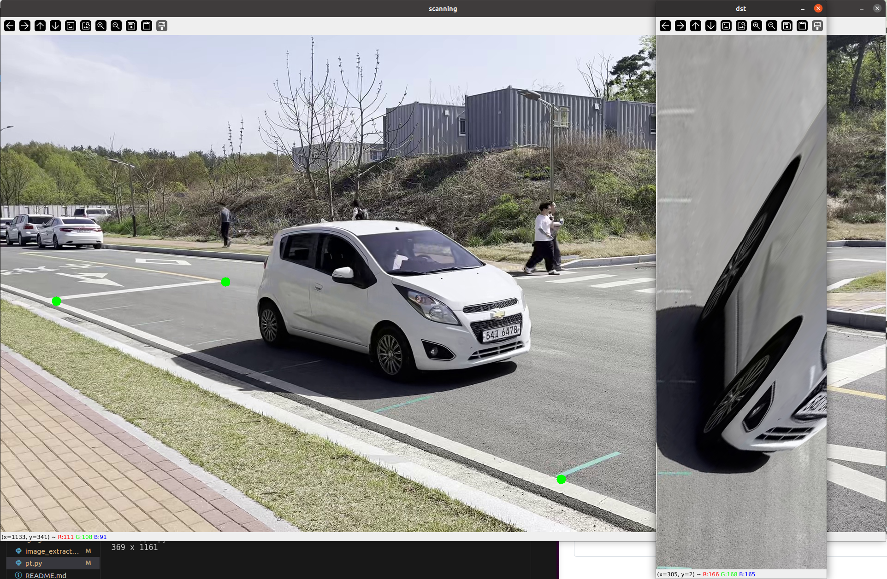
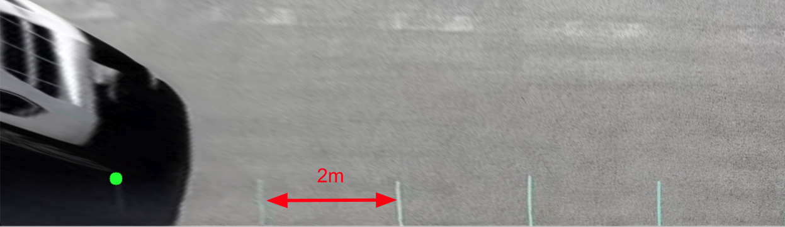
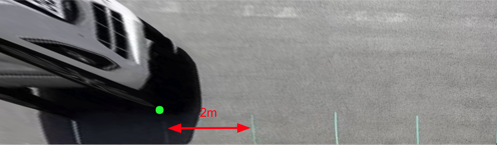
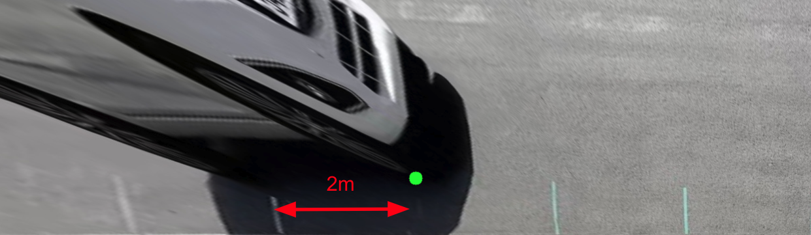
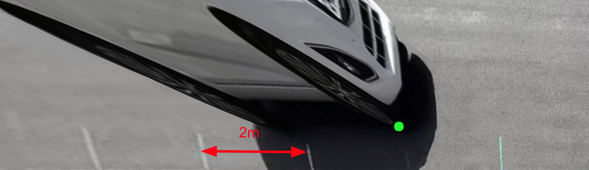
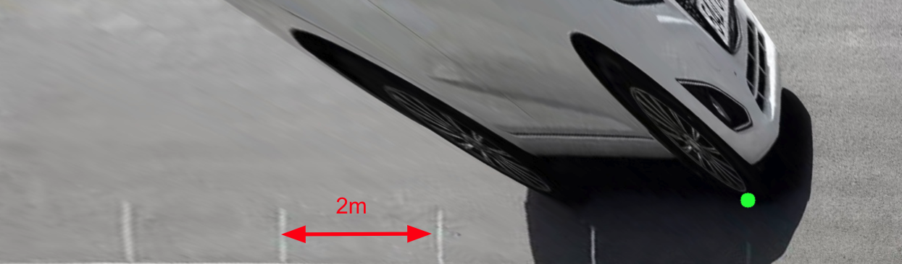
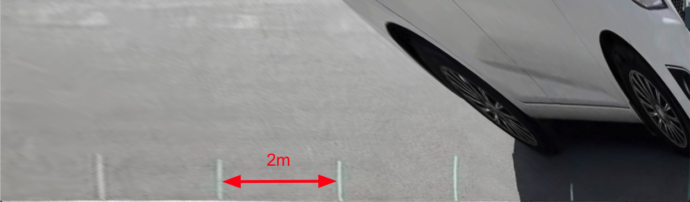

# Perspective_Transformation

### pt.py

* 시계 반대방향으로 찍어주면 됨
* 매 번 점을 찍어줄 필요는 없을 것 같음.
* 차량이 등장하기 전 탐색하고 싶은 영역의 사각형에 대한 4개의 점의 정보를 알아야함.
* 그 후에 차량이 등장으로 인해 점이 안보이는 문제를 것을 이전에 획득한 정보를 이용해서 해결 가능함.(추후 개발 예정)
* image_extractor.py를 이용하여 얻어낸 이미지의 시간 값을 이용해서 거리 계산 수행

### image_extractor.py

* 일단 뽑고봄.
* 이미지 이름은 시간으로 해놓음
* 이름 파싱해서 쓰면 될듯.
* 동영상 경로와 아웃풋 폴더 이름을 command parameter로 넣어줘야 할듯.

### length_estimation.py

* transformed img를 이용하여 차량이 출발점으로부터 얼마나 이동했는지 거리 측정
* 또한 현재 시간에서 출발 시각을 뺀 값을 이용하여 속도 측정

### Dataset Link

[GoogleDrive Link](https://drive.google.com/drive/folders/1DFn38g7Dl_5CvPWnmF2T5hJPOG5WOrpl?usp=sharing)

